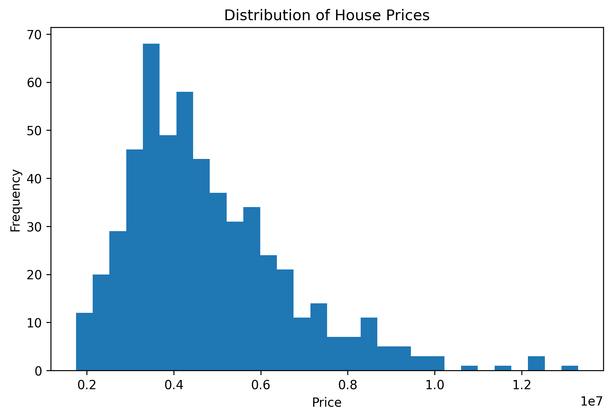
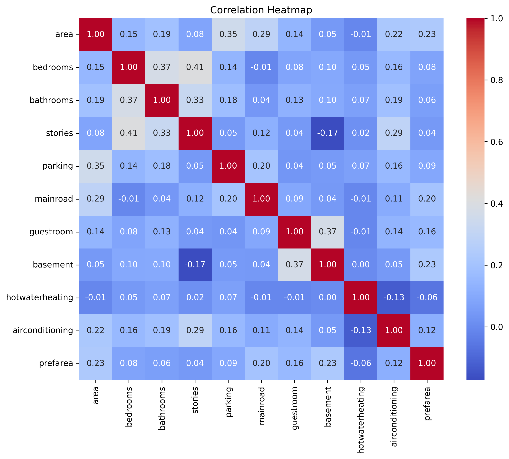
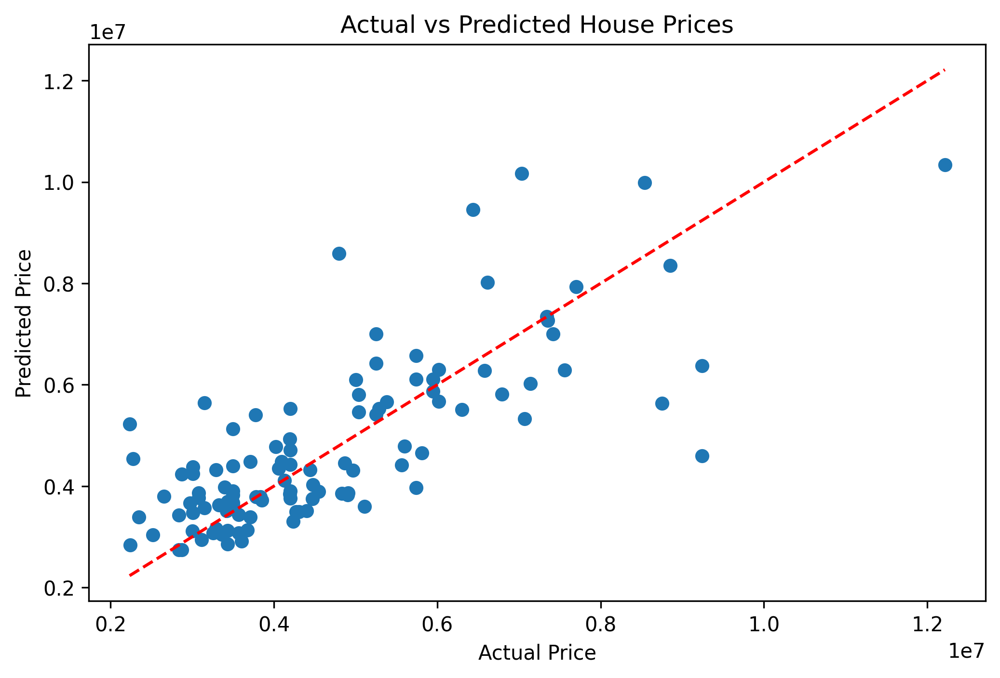
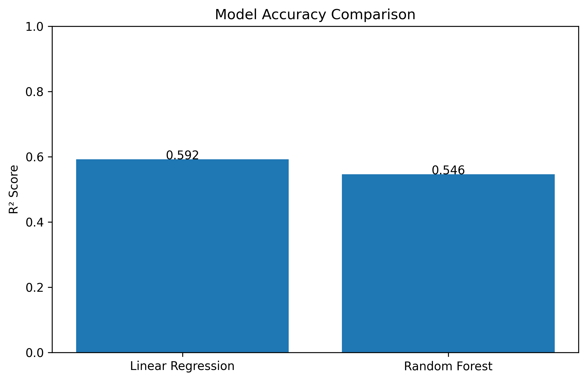
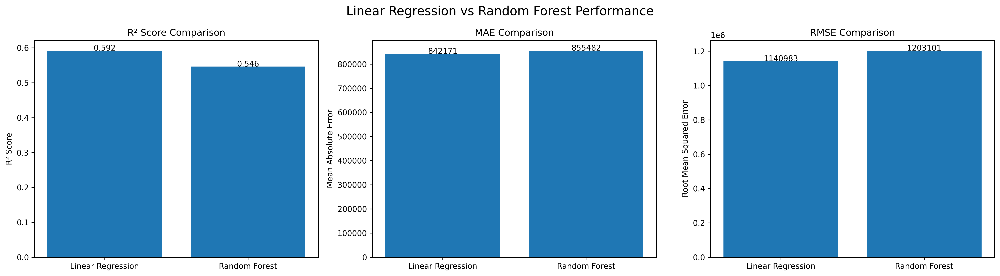

# House Price Prediction

A machine learning project that predicts residential house prices using property attributes such as area, bedrooms, bathrooms, stories, and amenities. Two regression models — **Linear Regression** and **Random Forest Regression** — are trained and compared on the same dataset.

## Overview

This project explores how well structured property data can predict house prices, and compares a simple linear model against an ensemble tree-based model. The full workflow covers data exploration, preprocessing, model training, evaluation, and visualization.

**Key result:** Linear Regression (R² = 0.592) slightly outperformed Random Forest Regression (R² = 0.546) on this dataset, with built-up area emerging as the single strongest predictor of price in both models.

## Dataset

The dataset (`Housing.csv`) contains **545 records** with **13 attributes**, sourced from a standard housing prices dataset. There are no missing values.

| Column | Type | Description |
|---|---|---|
| `price` | Numeric (target) | Sale price of the property |
| `area` | Numeric | Built-up area (sq. ft.) |
| `bedrooms` | Numeric | Number of bedrooms |
| `bathrooms` | Numeric | Number of bathrooms |
| `stories` | Numeric | Number of floors |
| `mainroad` | Categorical (yes/no) | Main-road access |
| `guestroom` | Categorical (yes/no) | Has a guest room |
| `basement` | Categorical (yes/no) | Has a basement |
| `hotwaterheating` | Categorical (yes/no) | Has hot water heating |
| `airconditioning` | Categorical (yes/no) | Has air conditioning |
| `parking` | Numeric | Number of parking spaces |
| `prefarea` | Categorical (yes/no) | Located in a preferred area |
| `furnishingstatus` | Categorical (3-class) | Furnished / semi-furnished / unfurnished |

## Project Structure

```
House_Price_Prediction_Project/
├── Housing.csv                      # Dataset
├── house_price_prediction.ipynb     # Main analysis & modeling notebook
├── house_price_histogram.png        # Chart: price distribution
├── correlation_heatmap.png          # Chart: feature correlation heatmap
├── actual_vs_predicted.png          # Chart: actual vs predicted prices
├── model_accuracy_comparison.png    # Chart: R² comparison
├── model_metrics_comparison.png     # Chart: combined R² / MAE / RMSE comparison
├── summary.pdf                      # Full written project report
└── README.md
```

## Visualizations

**Distribution of House Prices**



**Correlation Heatmap**



**Actual vs. Predicted Prices**



**Model Accuracy Comparison**



**Combined Metrics Comparison (R² / MAE / RMSE)**



## Methodology

1. **Data loading & inspection** — checked shape, data types, and confirmed no missing values.
2. **Preprocessing** — separated numeric and categorical features; encoded categorical columns (`mainroad`, `guestroom`, `basement`, `hotwaterheating`, `airconditioning`, `prefarea`) using `LabelEncoder`.
3. **Train/test split** — 80/20 split (436 training records, 109 test records), `random_state=41`.
4. **Model training** — trained both `LinearRegression` and `RandomForestRegressor` (`n_estimators=200`) on identical training data.
5. **Evaluation** — compared models using R² score, Mean Absolute Error (MAE), and Root Mean Squared Error (RMSE).
6. **Visualization** — generated distribution plots, correlation heatmaps, feature importance charts, and actual-vs-predicted scatter plots.

## Results

| Metric | Linear Regression | Random Forest |
|---|---|---|
| R² Score | **0.592** | 0.546 |
| MAE | ₹842,171 | ₹855,482 |
| RMSE | ₹1,140,983 | ₹1,203,101 |

Both models agree that **area**, **bathrooms**, and **air conditioning** are among the strongest drivers of price. Neither model explains more than ~60% of price variance, suggesting the dataset is missing location-level and qualitative factors that materially affect real-world pricing.

## Tech Stack

- **Python 3**
- **Pandas**, **NumPy** — data handling
- **Matplotlib**, **Seaborn** — visualization
- **Scikit-learn** — `LinearRegression`, `RandomForestRegressor`, `LabelEncoder`, `train_test_split`, evaluation metrics
- **Jupyter Notebook** — development environment

## Getting Started

### Prerequisites
```bash
pip install pandas numpy matplotlib seaborn scikit-learn jupyter
```

### Running the project
```bash
git clone https://github.com/Yadavji5739v/House_Price_Prediction_Project.git
cd House_Price_Prediction_Project
jupyter notebook house_price_prediction.ipynb
```
Run all cells in order. Charts will be regenerated and saved as PNG files in the project directory.

## Limitations & Future Work

- `furnishingstatus` was not included in the final feature set used for training — a natural next step is to encode it and re-evaluate.
- No hyperparameter tuning or cross-validation was performed; both models used default/fixed settings.
- The dataset lacks location-specific features (e.g. locality, neighborhood), which typically have strong predictive power for real estate prices.
- Future improvements could include Ridge/Lasso regression, Gradient Boosting/XGBoost, hyperparameter search via `GridSearchCV`, and log-transforming the (right-skewed) target variable.

## Report

A full written report with methodology, charts, and analysis is included: [`summary.pdf`](https://github.com/Yadavji5739v/House_Price_Prediction_Project/blob/main/summary.pdf)

## License

This project is for educational purposes.
